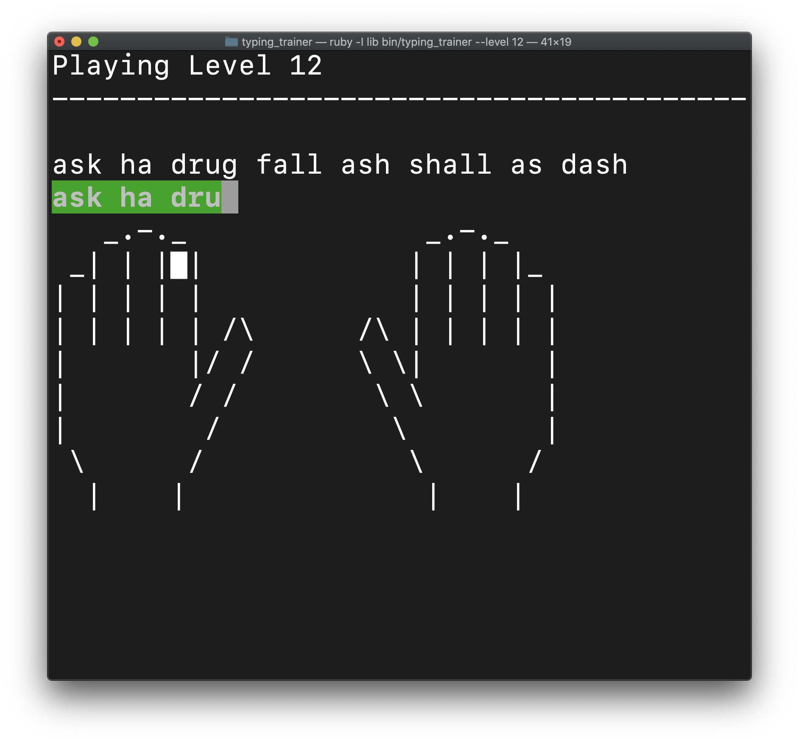

# TypingTrainer

Learn to touch type from your command line!

## Gameplay screenshots

## Installation

    $ gem install 'typing_trainer'

## Starting the game

    $ typing_trainer

To exit during game, use `Ctrl-C` or wait until asked if you want to continue playing.

## Usage

    $ typing_trainer --help

    Usage: typing_trainer [options]
    -l, --level LEVEL                The starting level to play
    -f, --file FILEPATH              Path to file containing custom text to use
    -a, --advanced                   Hide finger help (default show)
    -d, --debug                      Show debugging messages (default hide)

## Contributing

1. Fork it
2. Create your feature branch (`git checkout -b my-new-feature`)
3. Commit your changes (`git commit -am 'Added some feature'`)
4. Push to the branch (`git push origin my-new-feature`)
5. Create new Pull Request

## Architecture Overview

This project is comprised by the following elements:

1. `typing_trainer` - The binary to start the trainer
2. `TypingTrainer` - The high level runner
3. `TypingTrainer::Game` - Abstracts game mechanics and modes and screen
4. `TypingTrainer::LevelGenerator` - Generates levels based on a layout
5. `TypingTrainer::Level` - Represents a level: the text to use, instructions and settings
6. `TypingTrainer::KeyboardLayout` - Defines finger mappings and letter progressions

